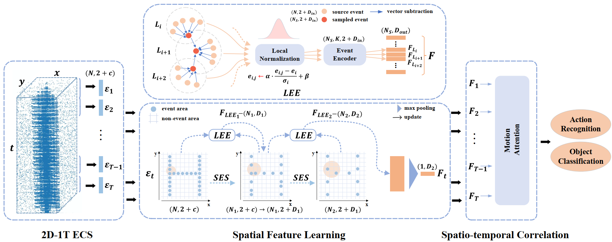

<div align="center">
  
  <h3 align="center"><strong>ECSNet: Spatio-temporal feature learning for event camera [TCSVT '22] </strong></h3>
    <p align="center">
    <a>Zhiwen Chen</a><sup>1</sup>&nbsp;&nbsp;
    <a>Jinjian Wu</a><sup>1</sup>&nbsp;&nbsp;
    <a>Junhui Hou</a><sup>2</sup>&nbsp;&nbsp;
    <a>Leida Li</a><sup>1</sup>&nbsp;&nbsp;
    <a>Leida Li</a><sup>1</sup>&nbsp;&nbsp;
    <a>Guangming Shi<sup>1</sup></a>&nbsp;&nbsp;
    <br>
    <sup>1</sup>Xidian University&nbsp;&nbsp;&nbsp;
    <sup>2</sup>City University of Hong Kong&nbsp;&nbsp;&nbsp;

</div>


## About

## Getting Started
### Installation
Clone the repository locally:
```
pip install git+https://github.com/happychenpipi/ECSNet.git
```

Create and activate a conda environment and install the required packages:
```
conda create -n ecsnet python=3.7
conda activate ecsnet
bash install_ecsnet.sh
```

### Data Preparation


## Training

## Pre-trained Model

## Evaluation

## Acknowledgments
Thanks to ... datasets, ... projects.

## Contact
Feedbacks and comments are welcome! Feel free to contact us via [zhiwen.chen@stu.xidian.edu.cn](zhiwen.chen@stu.xidian.edu.cn). 

## Citing ECSNet
If you use ECSNet in your research, please use the following BibTeX entry.

```
@article{chen2022ecsnet,
  title={Ecsnet: Spatio-temporal feature learning for event camera},
  author={Chen, Zhiwen and Wu, Jinjian and Hou, Junhui and Li, Leida and Dong, Weisheng and Shi, Guangming},
  journal={IEEE Transactions on Circuits and Systems for Video Technology},
  volume={33},
  number={2},
  pages={701--712},
  year={2022},
  publisher={IEEE}
}
```
